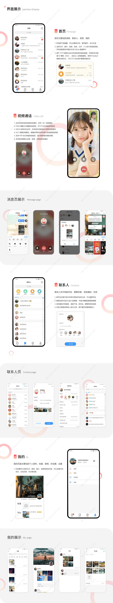

# im
基于 Xamarin.Android 开发 IM（即时通讯）系统，服务器端使用了 .NetCore 微服务架构，支持跨平台集群部署。

一款不依赖第三方通讯平台的 Xamarin.Android 聊天应用，私有化部署，使用 Xamarin.Android 开发，C# 调用底层 Android SDK，在 Visual Studio 中生成完全本机的 Android 应用。
详情地址：https://www.huzhan.com/code/goods358224.html

  
